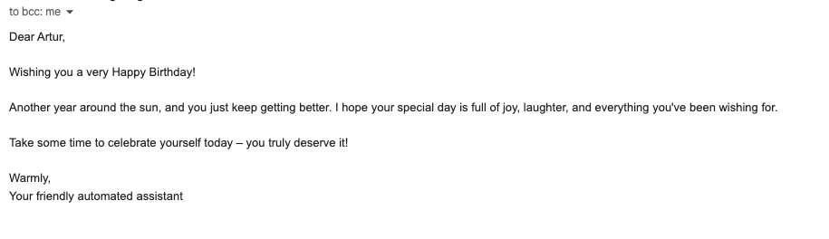

# 🎂 Automated Birthday Wisher
Python automation script that acts as your personal assistant. It checks date in local database, compare to current date and automatically sends a randomized, customized greeting email

## 🛠 Tech Stack
* **Python** 
* **Pandas** 
* **smtplib**
* **Datetime & Random** 

## ✨ Key Features
- **Automated Verification:** Uses the `datetime` module to match the current day and month with records in the database.
- **Dynamic Templating:** Randomly selects a letter template and dynamically inserts the recipient's name for a personalized touch.
- **UTF-8 Encoding:** Fully supports special characters and emojis in the email body, preventing encoding crashes.
- **Secure SMTP Connection:** Uses TLS encryption to securely log into a Gmail account and dispatch messages.

## 🧭 The Process
*if you have to do something more than twice, automate it.*
I built this project to practice automion scripts. Instead of relying on social media reminders, scripts uses `pandas` to read a `.csv` database and `smtplib` to send emails. It demonstrates potential standard Python libraries to solve real-world and everyday problems.

## 🚀 Running the Project
1. Clone this repository.
2. Install the required data manipulation library:
   ```bash
   pip install pandas
   ```
3. Place a `letter_1.txt`, `letter_2.txt`, `letter_3.txt`  and `birthdays.csv` in the project folder.
4. Run the script:
   `python main.py`
## 📸 Preview

